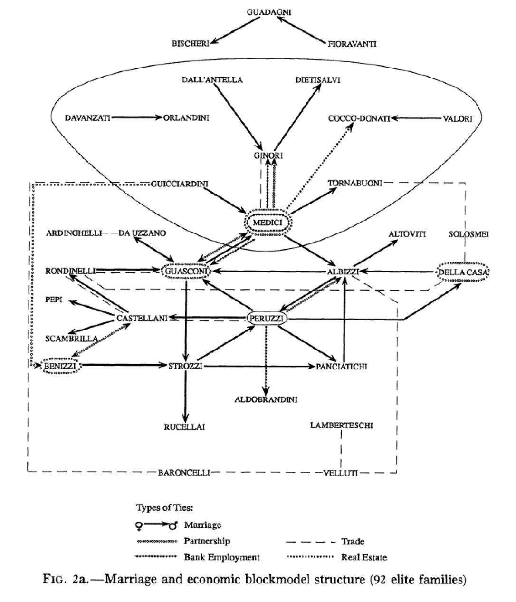

This seminar will emphasize the hands-on learning of working with geospatial data, with special attention paid to its application to the classroom. The workshop seeks to prep teachers to instruct their students in various approaches to spatial humanities in their classes. 

The workshop will address:

-   how maps are used in the humanities
-   how to find, create, and use spatial data
-   how to craft deep maps of place
-   how to use a variety of mapping tools
-   how to teach students the basics of spatial history

## Schedule (draft)

### Day 1: Digital Mapmaking

*9:00a--10:00a* 

- [Introduction](introduction-maps.md)
- [Spatial Literacy](literacy.md)
- [Spatial Narrative](narrative.md)
- [Spatial Data](spatial.md)

*10:00a--12:00p*

- [Georectification](georectification.md)
- [CartoDB](cartodb.md)
- [StoryMapJS](storymap.md)

### Day 2: Network Analysis

*9:00a--10:00a*

- [Introduction](introduction-networks.md)

*10:00a--12:00p*

- [Gephi](gephi.md)
- [Palladio](palladio.md)

 
